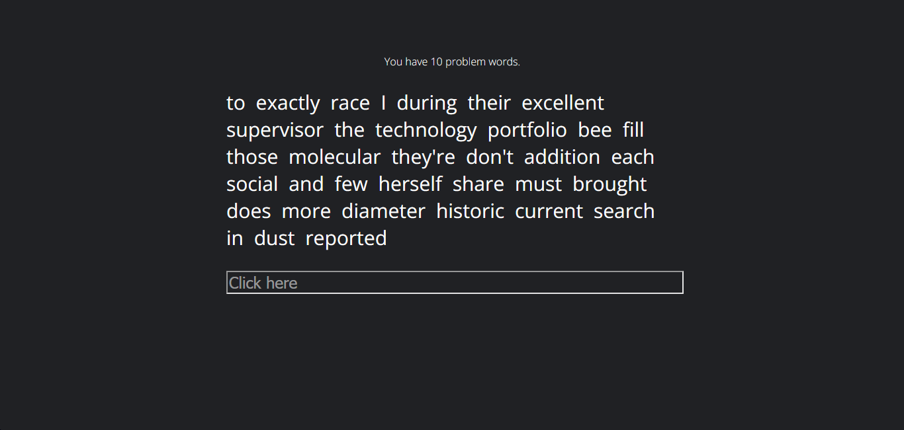
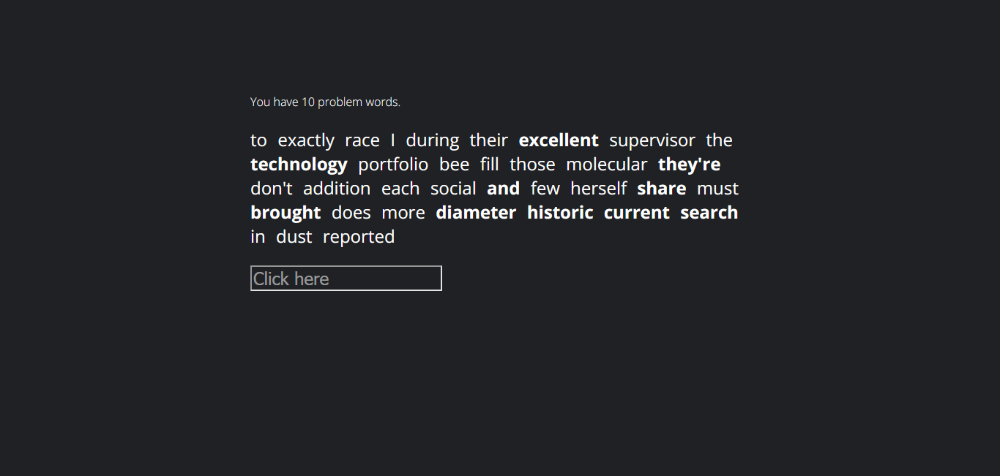
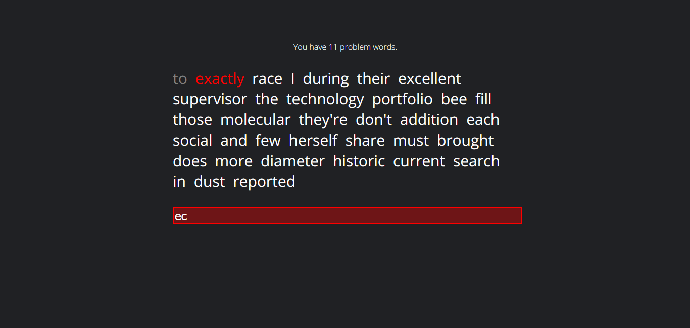
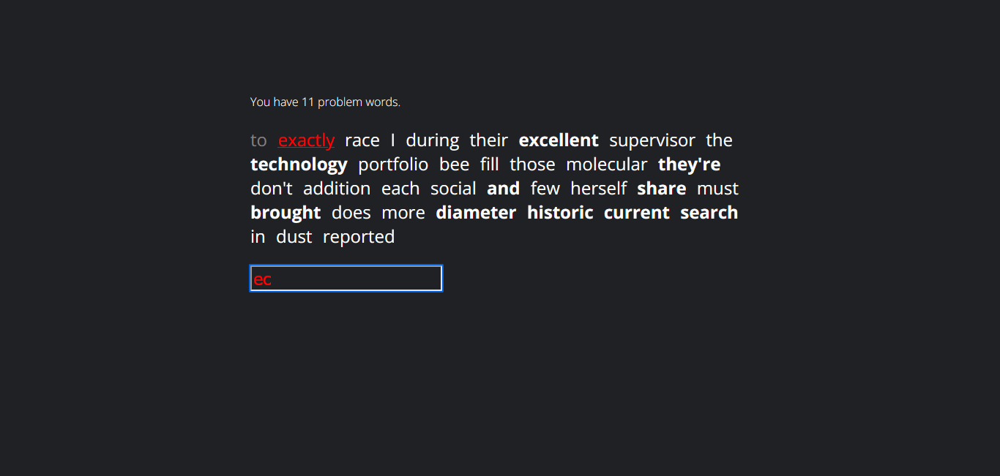
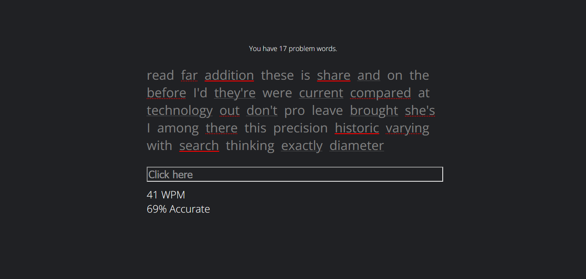
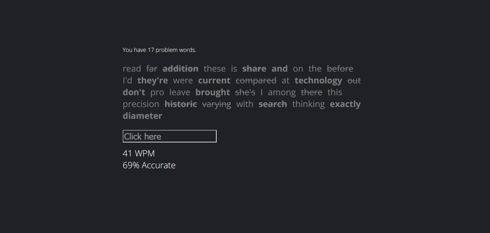

# problemwords userstyle

A user style for problemwords.com that I find to be nicer

## Screenshots

### Start

    
Default

    

### Typing/mistake

    
Default

    

### End

    
Default

    

